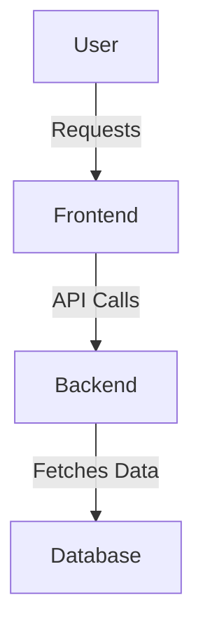
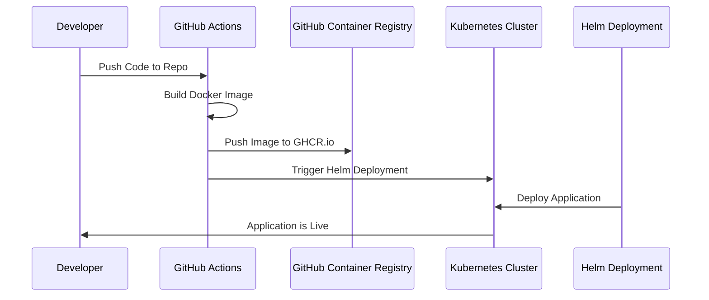
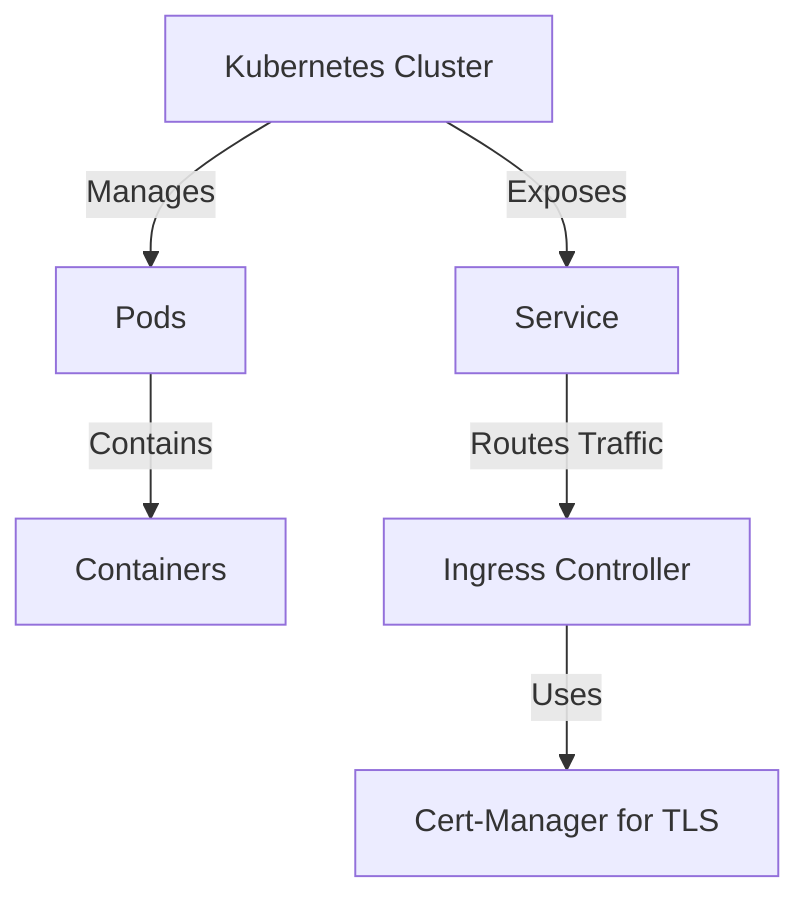

# Manishboard - GitHub Organization Infrastructure

Manishboard is a Java Spring Boot application deployed on Kubernetes. The infrastructure is built using Terraform, and the deployment process is automated using GitHub Actions, Helm, and GitHub Container Registry (GHCR).

## Overview of Infrastructure

### 1. **Infrastructure Provisioning**
- **Terraform** provisions the Kubernetes cluster.
- The cluster is hosted on **Linode Kubernetes Engine (LKE)**.
- **Cert-Manager** manages SSL/TLS certificates using **Let's Encrypt** and Cloudflare.

### 2. **Application Development and Containerization**
- The **Java Spring Boot** application is built and packaged as a **Docker image**.
- The image is stored in **GitHub Container Registry (GHCR.io)**.

### 3. **Continuous Integration & Deployment**
- **GitHub Actions** automates the build and deployment process.
- **Helm** is used to deploy the application on Kubernetes.

## Architecture Overview

## Deployment Process
1. **Code Push**: Developers push code to the GitHub repository.
2. **CI/CD Trigger**: GitHub Actions triggers the build and deployment workflows.
3. **Docker Build & Push**: The application is containerized and stored in GHCR.
4. **Deployment via Helm**: The Kubernetes cluster pulls the image and deploys the application.
## Workflow Breakdown

### 2. **Deployment Flow**

## Kubernetes Architecture

## Summary
- **Terraform** provisions the infrastructure.
- **GitHub Actions** automates the CI/CD process.
- **GitHub Container Registry (GHCR.io)** stores the container images.
- **Helm** manages Kubernetes deployments.
- **Cert-Manager** ensures secure communication with **Let's Encrypt**.

Manishboard's infrastructure is designed for scalability, automation, and security, ensuring a robust deployment strategy.

